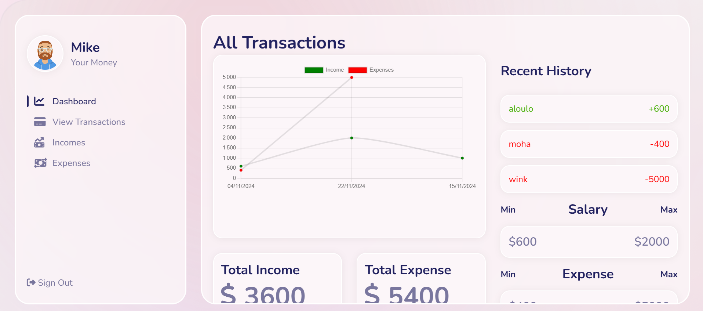

# App Node DevOps

This guide explains how to run the app locally, use Docker for containerization, and set up Azure Pipelines.


---

## Table of Contents
1. [How to Run the App Locally](#how-to-run-the-app-locally)
   - [Step 1: Set Up MongoDB](#step-1-set-up-mongodb)
   - [Step 2: Run the Backend App](#step-2-run-the-backend-app)
   - [Step 3: Run the Frontend App](#step-3-run-the-frontend-app)
2. [How to Run the App Using Docker](#how-to-run-the-app-using-docker)
   - [Step 1: Prepare Docker Compose](#step-1-prepare-docker-compose)
   - [Step 2: Build Docker Images](#step-2-build-docker-images)
     - [Backend](#backend)
     - [Frontend](#frontend)
   - [Step 3: Run Docker Containers](#step-3-run-docker-containers)
   - [Step 4: Stop and Remove Containers](#step-4-stop-and-remove-containers)
3. [How to Run Azure Pipelines](#how-to-run-azure-pipelines)
4. [Additional Notes](#additional-notes)

---

## Screendhots project

Below are screenshots showcasing the functionality and interface of the project:

### Home Page



---

## How to Run the App Locally

### Step 1: Set Up MongoDB

1. Create an account on [MongoDB Cloud](https://www.mongodb.com/cloud).
2. Create a cluster.

### Step 2: Run the Backend App

1. Navigate to the `backend` folder:

   ```bash
   cd backend

2. run `node-module`

    ```bash
    npm install

3. Start the `backend` app:

    ```bash
   npm start

### Step 3: Step 3: Run the Frontend App

1. Navigate to the `frontend` folder:

   ```bash
   cd frontend 

2. run `node-module`

    ```bash
    npm install

3. Start the `frontend` app:

   ```bash
   npm start

Note: Ensure the `.env` file is moved into the `frontend` folder for the app to run correctly locally.
In the `DataService`, create a connection and add your current IP address. This step is critical!

----

## How to Run the App Using Docker

### Step 1: Prepare Docker Compose

1. Verify that the `.env` file is not present in the `backend` folder. Move it if necessary.
2. Copy the contents of the `old-docker-compose` file into `docker-compose.yml`.

### Step 2: Build Docker Images

#### Backend

1. Navigate to the `backend` folder:

   ```bash
   cd backend

2. Build the `backend` app image:
    ```bash
   docker build -t node-backend:1.0 .

#### Frontend

1. Navigate to the `frontend` folder:

   ```bash
   cd frontend

2. Build the `frontend` app image:

    ```bash
   docker build -t node-frontend:1.0 .

### Step 3: Run Docker Containers

1. Start all containers:

   ```bash
   docker-compose up

2. (Optional) Rebuild and start containers:

    ```bash
   docker-compose up --build

### Step 4: Stop and Remove Containers

1. To stop and delete all containers:

    ```bash
   docker-compose down

----


## How to Run Azure Pipelines

1. Use the current `docker-compose.yml` file, not the one from `old-docker-compose`.
2. Ensure your `Azure Pipeline` references the correct `Docker Compose` configuration for deployment.


## Additional Notes

1. Always keep `.env` files out of production Docker images.
2. Ensure the MongoDB cluster is accessible with your IP for both local and Docker-based setups.

---

## Connect With Me

Feel free to connect with me through any of the platforms below:

## Connect With Me

[](https://github.com/AlaBenAchour)
[](https://www.linkedin.com/in/alabenachour/)
[](https://benachour-ala.vercel.app/)
[](mailto:alabenachour97@gmail.com)
